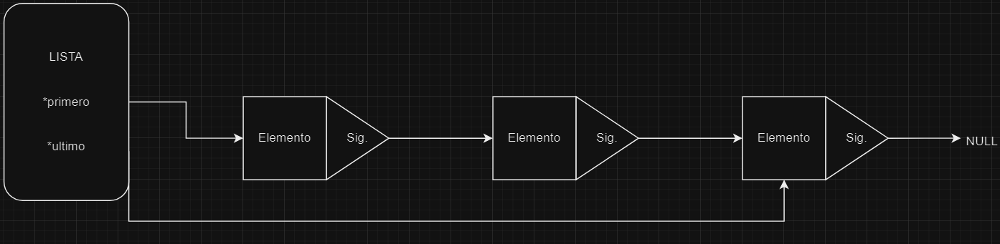
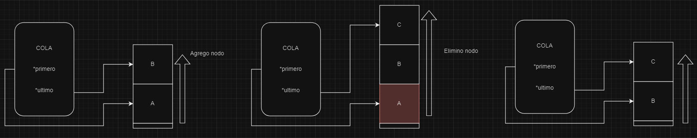
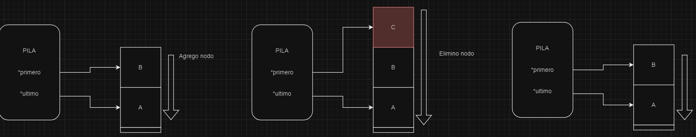

<div align="right">

</div>

# TDA Lista

## Repositorio de Ignacio Fernández - 111019 - iafernandez@fi.uba.ar

- Para compilar:

```bash
gcc -std=c99 -Wall -Wconversion -Wtype-limits -pedantic -Werror -O2 -g src/*.c pruebas_chanutron.o -o pruebas_chanutron
```

- Para ejecutar:

```bash
./pruebas_chanutron
```

- Para ejecutar con valgrind:
```bash
valgrind --leak-check=full --track-origins=yes --show-reachable=yes --error-exitcode=2 --show-leak-kinds=all --trace-children=yes ./pruebas_chanutron

```
---
##  Funcionamiento

#### Estructuras

La lista la definimos con un `nodo de inicio`, `nodo de fin` y `tamaño`. Si bien este último es omitible dentro de la implementación obligatoria, permite reducir el costo computacional donde se requiere saber la cantidad de elementos de la estructura. Sin este dato, cada vez que se necesitase consultarlo se debería iterar toda la lista hasta llegar al nodo que no tiene un siguiente, perjudicando a todos sus usos un costo de O(n). 
```c
struct lista {
	nodo_t *nodo_inicio;
	nodo_t *nodo_final;
	size_t tamanio; 
};
```

La estructura del iterador la definí con una `lista` y un `nodo actual`
```c
struct lista_iterador {
	lista_t *lista;
	nodo_t *actual;
};
```

### Organización del código

La creación de una lista, así como de cada uno de los nodos demanda el manejo de memoria. Al depender que que la memoria pueda reservarse correctamente, siempre valido que no haya habido fallas. Estas mismas validaciones corresponden a quien utiliza la función `lista_crear()`. Aplica de igual forma a iteradores.
```c
lista_t *lista_crear()
{
	return calloc(1, sizeof(lista_t));
}

nodo_t *nuevo_nodo_cargado(void *elemento, nodo_t *siguiente)
{
	nodo_t *nuevo_nodo = calloc(1, sizeof(nodo_t));

	if (!nuevo_nodo)
		return NULL;
    [...]
}
```
A lo largo del TP se utiliza en buena medida `nuevo_nodo_cargado`, la cual genera un nodo ya habiendo reservado la memoria y reduce la cantidad de codigo a escribir (como tener que asignar a cada nuevo cleinte el elemento, siguiente, etc)
Otra función de la que me ayudé fue `nodo_anterior_a_n`, la cual permite realizar la búsqueda de un nodo en una linea de manera facil y rápida, y es particularmente útil para los `pop's` de la estructura

```c
nodo_t *nodo_anterior_a_n(lista_t *li, size_t posicion)
{
	if (lista_vacia(li) || posicion >= li->tamanio || !posicion)
		return NULL;

	nodo_t *nodo_anterior = li->nodo_inicio;
	size_t i = 0;
	while (++i < posicion)
		nodo_anterior = nodo_anterior->siguiente;
	return nodo_anterior;
}
```

La inserción función `lista_insertar_en_posicion` fue utilizada como "hub" para separar los distintos casos y mejorar legibilidad y performance del código
```c
lista_t *lista_insertar_en_posicion(lista_t *lista, void *elemento,
				    size_t posicion)
{
	if (!lista)
		return NULL;
	if (posicion >= lista->tamanio)
		return lista_insertar(lista, elemento); //Costo: O(1)

	if (!posicion)
		return insertar_primer_lugar(lista, elemento); //Costo: O(1)

	nodo_t *nodo_anterior =
		nodo_anterior_a_n(lista, posicion); //Costo: O(n)

	return insertar_entre(lista, nodo_anterior, elemento); //Costo: O(1) <-- O(1) es insertar_entre. El proceso entero es O(n) por el suo de nodo_anterior_a_n
}
```

Otra implementación interesante fue la de `lista_destruir`:
Para evitar repeticiones de código y simplificar el mantenimiento y legibilidad, reutilizamos el otro método, asegurandonos de que la función simepre sea null para que así se ejecute siempre la lógica qu interesa a `lista_destruir`

```c
/**
 * Libera la memoria reservada por la lista.
 */
//Costo: O(n)
void lista_destruir(lista_t *lista)
{
	lista_destruir_todo(lista, NULL);
}

/**
 * Libera la memoria reservada por la lista pero además aplica la función
 * destructora dada (si no es NULL) a cada uno de los elementos presentes en la
 * lista.
 */
//Costo: O(n)
void lista_destruir_todo(lista_t *lista, void (*funcion)(void *))
{
	if (!lista)
		return;

	nodo_t *nodo_actual = lista->nodo_inicio;
	nodo_t *nodo_pivote;

	while (nodo_actual) {
		if (funcion)
			funcion(nodo_actual->elemento);

		nodo_pivote = nodo_actual;
		nodo_actual = nodo_actual->siguiente;
		free(nodo_pivote);
	}
	free(lista);
}
```

#### Iterador externo
Al trabajar con un struct privado, el usuario que utiliza nuestra biblioteca no puede acceder a las características de los nodos y de esta forma no puede recorrer la estructura. Es por eso que se ofrece un iterador externo para que el cliente/usuario/etc tenga la capacidad de recorrer la estructura.
Para el uso del iterador se reserva memoria que luego debe ser liberada,

### Iterador interno
El iterador interno, a diferencia del externo, sí tiene acceso a la definicion de las estructuras y es por ello que puede accedesere a propiedades propias de los nodos, como por ej
```c
while (nodo_actual && ++i && funcion(nodo_actual->elemento, contexto))
```
---
### Pila y Cola

Siendo que la Lista ya provee las funcionalidades para Pila y Cola, el código puede reutilizarse.
Para esto hay que tener un pequeño cuidado: Los tipos no coinciden.

En escencia las 3 funcioes hacen lo mismo, pero tienen tipos de dato incompatibles. `lista_crear()` es llamada por las otras dos, sin embargo, su tipo de retorno es `lista_t *`, cuando el esperado es por ejemplo `pila_t`.
```c
lista_t *lista_crear();
pila_t *pila_crear();
cola_t *cola_crear();
```
Ante esta situación se recurre a los casteos.
En el siguiente fragmento se muestra como no solo se castea el valor de retorno de la función, sino tambien uno de los parámetros que se le pasa a la misma.
```c
cola_t *cola_encolar(cola_t *cola, void *elemento)
{
	return (cola_t *)lista_insertar((lista_t *)cola, elemento); 
}
```

Como ambas estructuras presentan mucha similitud, vamos a enfocar el análisis en sus diferencias. Estas se pueden ver en:
* Posicion clave (Tope/Frente)
* Agregar
* Eliminar

Se aclara que todas estas funciones tienen un costo C(1)
#### Pila
El tope de la pila es el primer nodo de la misma. En las respuestas teóricas se explica el motivo
```c
void *pila_tope(pila_t *pila)
{
	return lista_primero((lista_t *)pila);
}
```

Para agregar, insertamos el elemento al final de la cola
```c
pila_t *pila_apilar(pila_t *pila, void *elemento)
{
	return (pila_t *)lista_insertar_en_posicion((lista_t *)pila, elemento, 0);
}
```

Para eliminar, sacamos el elemento en la posición clave (Frente)
```c
void *pila_desapilar(pila_t *pila)
{
	return lista_quitar_de_posicion((lista_t *)pila, 0);
}
```
#### Cola
El frente de la cola es el primer nodo de la misma.
```c
void *cola_frente(cola_t *cola)
{
	return lista_primero((lista_t *)cola);
}
```

Para agregar, insertamos el elemento al final de la cola
```c
cola_t *cola_encolar(cola_t *cola, void *elemento)
{
	return (cola_t *)lista_insertar((lista_t *)cola, elemento);
}
```

Para eliminar, sacamos el elemento en la posición clave (Frente)
```c
void *cola_desencolar(cola_t *cola)
{
	return lista_quitar_de_posicion((lista_t *)cola, 0); 
}
```

---

## Respuestas a las preguntas teóricas

Diagramas:
* La flecha gruesa indica el sentido de recorrido de los nodos
* El grafico se interpreta de izquierda a derecha, para mostrar como se actualiza una pila y una cola
### ¿Que es una Lista (simplemente enlazada)?
Una lista es una estructura de datos que almacena los mismos en nodos. Cada uno de estos nodos guarda su respectivo dato y apunta al siguiente, diseñada para  recorrerse  en el orden en el que los datos fueron ingresados, pero no al reves, saltando de un nodo a su siguiente hasta encontrar que el siguiente del nodo actual es NULL, o sea, no tiene siguiente y por ende es el último.
<div align="center">

</div>

### ¿Que es una Cola?
Una cola es una implementación de una lista, por lo que es tambien una estructura de datos. La característica de la cola es que respeta el concepto FIFO. Esto significa que la cola fue diseñada para que los datos se accedan y eliminen de la cola en el orden que fueron ingresados. Si se ingresa A-B-C, la salida va a ser en el orden A, luego B y luego C.
<div align="center">

</div>
### ¿Que es una Pila?
Al igual que la cola, una pila es una implementacion de una lista y por ende una estructura de datos. Se diferencia de la cola ya que en lugar de utilizar el concepto FIFO, utiliza LIFO. O sea, el último elemento ingresado es el más próximo a salir. En un ingreso A-B-C, la salida será C, luego B y luego A.
<div align="center">

</div>

### Explica y analiza las diferencias de complejidad entre las implementaciones de lista simplemente enlazada, doblemente enlazada y vector dinámico para las operaciones

* Simplemente enlazada:
* * Insertar en el medio: O(n), ya que se debe iterar desde el inicio de la lista la cantidad de "siguientes nodos" hasta alcanzar la posicion deseada
* * Obtener en el medio: O(n), ya que se debe iterar desde el inicio de la lista la cantidad de "siguientes nodos" hasta alcanzar la posicion deseada
* * Eliminar en el medio: O(n), ya que se debe iterar desde el inicio de la lista la cantidad de "siguientes nodos" hasta alcanzar la posicion deseada. Una vez en el nodo, la accion es O(1) porque no necesitan desplazarse los nodos siguientes. O sea, el costo está dado por la búsqueda del nodo.


* Doblemente enlazada:
* * Insertar en el medio: O(n), ya que se debe iterar desde el inicio de la lista la cantidad de "siguientes nodos" hasta alcanzar la posicion deseada
* * Obtener en el medio: O(n), ya que se debe iterar desde el inicio de la lista la cantidad de "siguientes nodos" hasta alcanzar la posicion deseada
* * Eliminar en el medio: O(n), ya que se debe iterar desde el inicio de la lista la cantidad de "siguientes nodos" hasta alcanzar la posicion deseada. Una vez en el nodo, la accion es O(1) porque no necesitan desplazarse los nodos siguientes. O sea, el costo está dado por la búsqueda del nodo.

* Vec. dinámico:
* * Insertar en el medio: O(n). El acceso a la posición es directo (O(1)), pero luego se debe "desplazar" todo el resto del vector hacia adelante (O(n), se itera por cada posición delante de donde se inserta)
* * Obtener en el medio: O(1), el acceso es directo al subindice que se indica.
* * Eliminar en el medio: O(n). El acceso a la posición es directo (O(1)), pero luego se debe "desplazar" todo el resto del vector hacia atras (O(n), se itera por cada posición delante de donde se inserta)


Hago un parentesis por las dudas. Si la pregunta se refería a que dado un Nodo debo hacer alguna de las acciones, en lugar de dada una lista (ej, se me pasa la direccion del 3er nodo, en lugar de darme la lista y yo tener que buscar el 3er nodo), el costo de eliminar en el medio para la lista doblemente enlazada sería O(1), ya que desde el nodo conocemos a su nodo anterior para modificar el siguiente del mismo.
Siguiendo con esta suposicion, los costos de inserción y obtención, tanto para la lista simple como la doble, serían O(1) también.
### Explica la complejidad de las operaciones implementadas en tu trabajo para la pila y la cola.
Todos los métodos implementados en mi trabajo de pila y cola tiene una complejidad de O(1).
Los métodos interesantes a análizar son:
* Apilar: Para mantener un costo de O(1), al apilar en la cola utilizamos el método de lista `lista_insertar_en_posicion`, indicando la posicion 0. Esta es la primer posicion de la lista, por lo que agregar o eliminar nodos no demanda recorrer la estructura, solamente accedemos a la primer posicion. De plantearse al reves la lista, considerando nuestro tope la última posicion y haciendo las inserciones en la misma, en `Apilar` no representa un problema ya que conocemos de antemano cual es el último nodo.
* Despilar: Similar a Apilar, pero utilizando el método `lista_quitar_de_posicion`, tambien indicando la posicion 0. La implementación inversa, donde el tope es la última y no la primera posicion, no es eficiente a la hora de desapilar (a diferencia de apilar). Al desapilar, al eliminar la última posicion luego debe recorrerse toda la estructura (costo O(N)) hasta llegar a la nueva ultima posicion (anteultima antes de la eliminacion) para modificar su siguiente y que ahora apunte a NULL. Por esto es por lo que utilizamos como tope la primer posicion y no hacemos la inserción a la última como podría parecer más intuitivo.
* Encolar: Para encolar, y con un costo de O(1), utilizamos `lista_insertar`. Al ser conocida la última posicion de la lista, agregar un nodo a la misma no demanda recorrer la estructura. Siendo que cada nuevo nodo es insertado al final de la cola, nuestro frente de cola tiene que ser la primer posicion, que es la más alejada del último nodo insertado. Esta posicion tambien es conocida por lo que no demanda recorrer la estructura.
* Desencolar: Para desencolar, por la mísma lógica que en `Desapilar`, el nodo a eliminar debe ser el primero de la estructura para así evitar recorrerla y mantener el costo de O(1). Planteando la cola al reves (Frente en la última posicion, encolar a la primera), desencolar requeriría recorrer la estructura entera para poder modificar al segundo elemento de la cola y que pase a ser el primero (o sea, eso implicaría un costo O(n)).

--Estos son comunes a pila y cola
* Creación: O(1), ya que solo se reserva la memoria de la lista, pero no de los nodos (no existen nodos al moemnto de crearla).
* Destrucción: O(n), ya que debe iterarse item por item de la lista para liberar la memoria.
